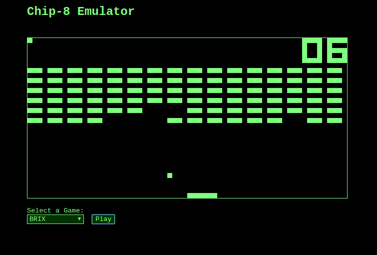

# functional-ts-chip8



This is my CHIP-8 emulator written in Typescript with ES6. I also wrote this emulator using the functional programming paradigm. All of the CPU has been coded using pure functions that do not mutate state. I have also tried to push all side effects to the edges of my program as much as possible. `emulator.ts` is the one area of the program where I was forced to use a stateful object. 

This program also has only one dependency. It was originally written using React and Redux, but I removed these dependencies because they weren't providing any benefit at all. 

## Why Functional Programming?

I'm personally a fan of the functional programming paradigm because I believe when you compose your programs using pure functions, it makes code a lot easier to follow. It also helps reduce bugs. 

I was a little concerned at first because a downside of not mutating state is slower performance. That would especially be a big deal in an emulator. I was surprised to learn that composing my emulator using pure functions didn't seem to have any noticeable effect on performance at all.

## How to Run

You will need to have node and npm setup first before you can run this program locally. 

### Installing and Running

First run the following command to install all dependencies:
```
$ npm install
```

You can then run the following commands to run the project locally:
```
$ npm run build
$ npm run start
```

### Running Unit Tests

This project contains a test suite that tests all of the CPU opcodes and logic. You can run unit tests using the following command:
```
$ npm run test
```
